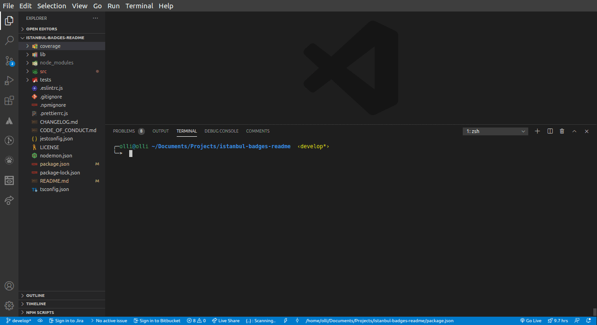

# Istanbul Badges Readme

> Creates README badges from istanbul coverage report

| Statements                | Branches                | Functions                | Lines                |
| ------------------------- | ----------------------- | ------------------------ | -------------------- |
|  |  |  |  |

---

#### Current Version: 1.2.0

## Table of Contents

- [Markup example](<#markup-example-(paste-it-anywhere-in-your-README.md)>)
- [Running example](#running-example)
- [Requirements](#requirements)
- [Installation](#installation)
- [Usage](#usage)
- [Usage as a part of your githooks](#usage-as-a-part-of-your-githooks)
- [See more examples](#see-more-examples)
- [Contributors](#contributors)
- [License](#license)

---

## Markup example (paste it anywhere in your README.md)

```markdown
| Statements                  | Branches                | Functions                 | Lines                |
| --------------------------- | ----------------------- | ------------------------- | -------------------- |
|  |  |  |     |
```

- The table is **optional**, the only markup that matters are the following:

1. ``
1. ``
1. ``
1. ``

---

## Running example



---

### Requirements

- **Must** have at least one of the [before mentioned markup items](<#example-markup-(paste-it-anywhere-in-your-README.md)>);
- You should have **json-summary** as a **coverageReporter** in your tests configuration;
- For example, if you are using Jest, configuration should either be within `package.json` or inside your jest config file i.e. `jest.config.js` or `jestconfig.json` as shown below:

```json
  "coverageReporters": ["json-summary"]
```

- See more in the [examples](./examples/README.md).

---

## Installation

```bash
  npm i -D istanbul-badges-readme
```

---

## Usage

- Simply run it from the CLI as follows:

```bash
  npm run istanbul-badges-readme
```

- Custom coverage directory? Use **--coverageDir** argument:

```bash
  npm run istanbul-badges-readme --coverageDir="./my-custom-coverage-directory"
```

- Want it without logging? Try silent mode with **--silent** argument:

```bash
  npm run istanbul-badges-readme --silent
```

- Or add it to your **package.json** scripts as follows:

```json
"scripts": {
  "make-badges": "istanbul-badges-readme",
}
```

---

## Usage as a part of your githooks

- If you want to have this run on the **pre-commit** hook and update the commit in place, just install husky and add the `pre-commit` script to your package.json.

1. Install Husky.

```bash
  npm install -D husky
```

2. Add your **pre-commit** script:

```json
  "husky": {
    "hooks": {
      "pre-commit": "npm run test && istanbul-badges-readme && git add 'README.md'"
    }
  }
```

3. Git Commit and Push. Just use your workflow as usual. If your tests fail, no commit. If they pass, update the README.md and add the file to the commit. Nice!

---

## See more examples

[Examples folder](./examples/README.md)

---

## Contributors

Thanks goes to these wonderful people ([emoji key](https://allcontributors.org/docs/en/emoji-key)):

<!-- ALL-CONTRIBUTORS-LIST:START - Do not remove or modify this section -->
<!-- prettier-ignore-start -->
<!-- markdownlint-disable -->
<table>
  <tr>
    <td align="center"><a href="https://olavoparno.github.io"><br /><sub><b>Olavo Parno</b></sub></a><br /><a href="#ideas-olavoparno" title="Ideas, Planning, & Feedback">🤔</a> <a href="https://github.com/olavoparno/istanbul-badges-readme/commits?author=olavoparno" title="Code">💻</a> <a href="https://github.com/olavoparno/istanbul-badges-readme/commits?author=olavoparno" title="Tests">⚠️</a></td>
    <td align="center"><a href="https://github.com/nothingismagick"><br /><sub><b>nothingismagick</b></sub></a><br /><a href="#ideas-nothingismagick" title="Ideas, Planning, & Feedback">🤔</a> <a href="https://github.com/olavoparno/istanbul-badges-readme/issues?q=author%3Anothingismagick" title="Bug reports">🐛</a> <a href="#content-nothingismagick" title="Content">🖋</a></td>
    <td align="center"><a href="http://www.fallenclient.co.uk"><br /><sub><b>Dave Fisher</b></sub></a><br /><a href="https://github.com/olavoparno/istanbul-badges-readme/issues?q=author%3Afallenclient" title="Bug reports">🐛</a></td>
    <td align="center"><a href="http://twitter.com/zaggino"><br /><sub><b>Martin Zagora</b></sub></a><br /><a href="#ideas-zaggino" title="Ideas, Planning, & Feedback">🤔</a> <a href="https://github.com/olavoparno/istanbul-badges-readme/issues?q=author%3Azaggino" title="Bug reports">🐛</a></td>
    <td align="center"><a href="https://github.com/engineervix"><br /><sub><b>Victor Miti</b></sub></a><br /><a href="https://github.com/olavoparno/istanbul-badges-readme/issues?q=author%3Aengineervix" title="Bug reports">🐛</a></td>
    <td align="center"><a href="http://signalwerk.ch"><br /><sub><b>Stefan Huber</b></sub></a><br /><a href="#question-signalwerk" title="Answering Questions">💬</a> <a href="https://github.com/olavoparno/istanbul-badges-readme/commits?author=signalwerk" title="Documentation">📖</a></td>
  </tr>
</table>

<!-- markdownlint-enable -->
<!-- prettier-ignore-end -->
<!-- ALL-CONTRIBUTORS-LIST:END -->

This project follows the [all-contributors](https://github.com/all-contributors/all-contributors) specification. Contributions of any kind welcome!

---

## License

Istanbul Badges Readme is [MIT licensed](./LICENSE).
